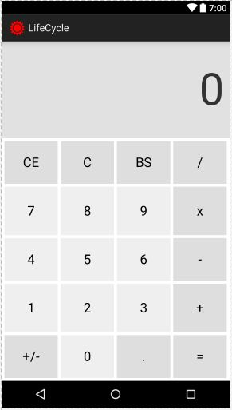

# Android.VP.20231.SimpleCalculator1
Android App - Simple Calculator

### **Bài 1. Lập trình ứng dụng SimpleCalculator với các yêu cầu sau:**

\+ Giao diện tương tự như ảnh minh họa, các nút bấm số có màu nền trắng, các nút bấm khác có màu nền xám (cần có hiệu ứng đổi màu khi nhấn) 

\+ Thực hiện các phép tính cộng, trừ, nhân, chia với các toán hạng là số nguyên (bỏ qua nút bấm dấu chấm)

\+ Các nút chức năng CE: Clear Entry - Xóa toán hạng hiện tại về 0, C: Clear - Xóa phép tính, BS: Backspace - Xóa chữ số hàng đơn vị của toán hạng hiện tại (nếu còn 1 chữ số thì xóa về 0)

